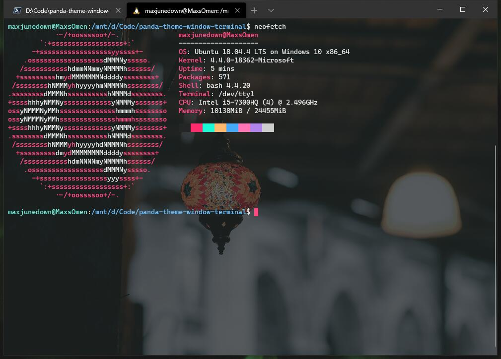
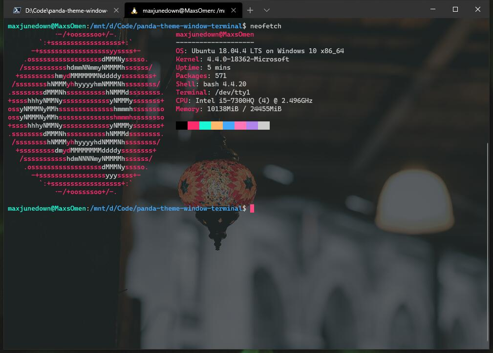

# 🐼Panda Theme for Windows Terminal (bootleg)

## Preview



Panda Light



Panda Vivid

---

## Color Scheme

```json
{
  "profiles": {
    "defaults": {
      "colorScheme": "Panda Light", // Or Panda Vivid
      "cursorColor": "#FF4B82"
    }
  },
  "schemes": [
    {
      "name": "Panda Vivid",
      "background": "#292A2B",
      "black": "#000000",
      "blue": "#45A9F9",
      "brightBlack": "#242526",
      "brightBlue": "#45A9F9",
      "brightCyan": "#B084EB",
      "brightGreen": "#19f9d8",
      "brightPurple": "#FF75B5",
      "brightRed": "#FF2C6D",
      "brightWhite": "#CDCDCD",
      "brightYellow": "#FFB86C",
      "cyan": "#B084EB",
      "foreground": "#CDCDCD",
      "green": "#19f9d8",
      "purple": "#FF75B5",
      "red": "#FF2C6D",
      "white": "#CDCDCD",
      "yellow": "#FFB86C"
    },
    {
      "name": "Panda Light",
      "background": "#242526",
      "black": "#242526",
      "blue": "#45A9F9",
      "brightBlack": "#757575",
      "brightBlue": "#6fc1ff",
      "brightCyan": "#BCAAFE",
      "brightGreen": "#6FE7D2",
      "brightPurple": "#FF9AC1",
      "brightRed": "#FF4B82",
      "brightWhite": "#E6E6E6",
      "brightYellow": "#FFCC95",
      "cyan": "#B084EB",
      "foreground": "#E6E6E6",
      "green": "#19f9d8",
      "purple": "#FF75B5",
      "red": "#FF2C6D",
      "white": "#CDCDCD",
      "yellow": "#FFB86C"
    }
  ]
}
```
